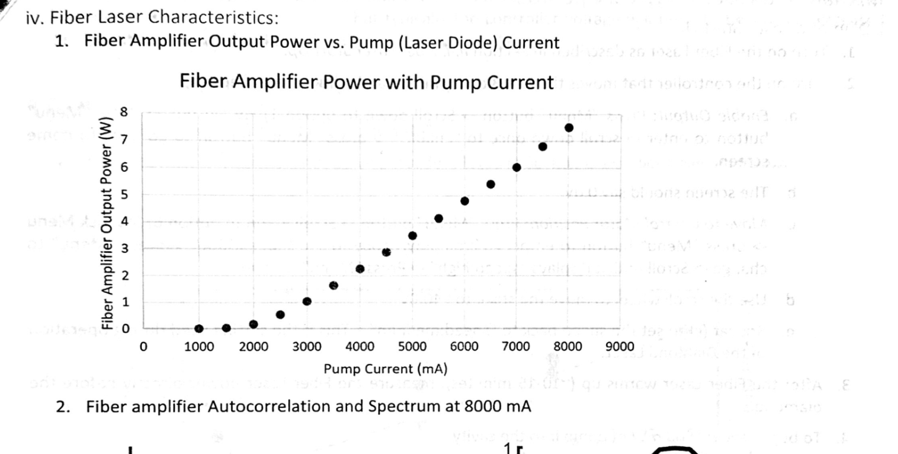
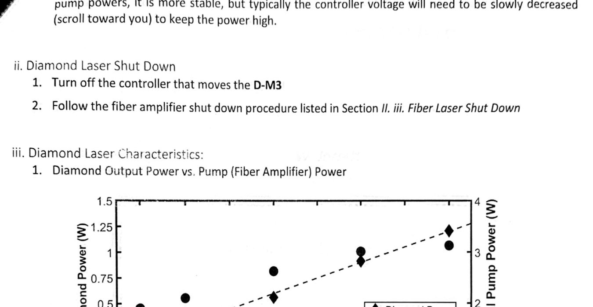
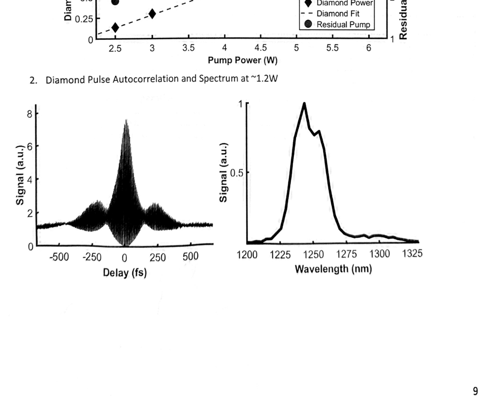

# Fiber Amplifier and Diamond Raman Laser Standard Operating Procedure

**Authors:** Jeremy W. Jarrett & Shaun Engelmann  
**Last Updated:** 5/20/2021

---

## Table of Contents

1. [Optical Layouts](#i-optical-layouts) (p. 2)  
2. [Fiber Laser – Typical Operation](#ii-fiber-laser-–-typical-operation) (p. 3)  
   1. [Fiber Laser Start Up](#i-fiber-laser-start-up) (p. 3)  
   2. [Directing Output and Changing Pulse Width](#ii-directing-output-and-changing-pulse-width) (p. 6)  
   3. [Fiber Laser Shut Down](#iii-fiber-laser-shut-down) (p. 6)  
   4. [Fiber Laser Characteristics](#iv-fiber-laser-characteristics) (p. 7)  
3. [Diamond Laser – Typical Operation](#iii-diamond-laser-–-typical-operation) (p. 8)  
   1. [Diamond Laser Start Up](#i-diamond-laser-start-up) (p. 8)  
   2. [Diamond Laser Shut Down](#ii-diamond-laser-shut-down) (p. 9)  
   3. [Diamond Laser Characteristics](#iii-diamond-laser-characteristics) (p. 9)  

---

## I. Optical Layouts

Table layout for both systems. The optical components are (mostly) labeled with their corresponding subsystem (F- for Fiber Laser; D- for Diamond Laser; e.g. F-M1 is the first mirror in the fiber laser setup).

---

## II. Fiber Laser – Typical Operation

### I. Fiber Laser Start Up

1. **Turn key to “on”** on the fiber laser controller box. Lights will flash as the oscillator begins its start-up procedure.  
2. While the oscillator warms up, **turn on** the pump temperature controller (I/O switch) and **start** the Arroyo control software on the computer.  
3. **Select “Connect”** and then set the output to “On” in the Arroyo software.  
   - The temperature should be set to 25 °C.  
   - *Make sure that the fan on the TEC is spinning. If not, the diode will overheat at high output power.*  
4. **Turn on** the pump power controller.  
5. Once the oscillator has finished its start-up sequence, **press the red button** on the controller box to let the seed laser out.  
   - The red button will illuminate once pressed.  
   - If everything is working correctly with the oscillator, there should be a pulse train visible on the oscilloscope.  
6. **Position** the high-power power meter between F-Shutter and F-HWP2.  
7. **Open** (“enable”) the shutter to make sure the output will reach the power meter.  
8. **“Engage”** the pump diode (press “Output” button; blue LED should light) and slowly ramp up the pump current to as high as 8000 mA (turn dial clockwise in 250 mA steps, waiting for stabilization).  
   - **Recommended power readings on the meter**  
     1. ~0.2 W at 2000 mA  
     2. ~2.3 W at 4000 mA  
     3. ~4.8 W at 6000 mA  
     4. ~7.5 W at 8000 mA  
   - See a complete chart below.  
9. **Let the laser warm** up for ~10 minutes (power will drop slightly).  
10. **Shutter** the laser with F-Shutter, place meter in one GLP path, deactivate shutter, and rotate F-HWP2 to adjust to the desired level.  
    - **Caution:** the laser is very powerful at high pump currents—shutter as needed.  

---

### II. Directing Output and Changing Pulse Width

1. **Directing Output**  
   The Fiber Laser output can be split into two orthogonally-polarized paths via F-GLP—one for imaging, one for diamond pumping.  
   - For diamond operation, use F-HWP2 to tune pump power.  
   - **If only imaging**, block the diamond path before the diamond.  
2. **Changing Pulse Width**  
   Pulse width is controlled by grating pair F-G1 & F-G2. Translating F-G2 changes the width.  
   - **Shortest-pulse positions** at objective focus:  
     - 6.625 @ 4000 mA  
     - 4.75  @ 6000 mA  
     - 2.5   @ 8000 mA  
   - For diamond pumping, use **2.75** @ 8000 mA.  

---

### III. Fiber Laser Shut Down

1. Close shutter (press “enable”).  
2. Ramp down pump current to 1000 mA (−250 mA steps).  
3. Wait 1–2 minutes.  
4. Turn off pump controller (I/O switch).  
5. Turn off seed oscillator (turn key to “off”).  
6. Wait 10–15 minutes for pump laser to cool.  
7. In Arroyo control, turn off cooler output then “Disconnect.”  
8. Turn off laser cooler (I/O switch).  

---

### IV. Fiber Laser Characteristics

1. **Fiber Amplifier Output Power vs. Pump Current**  
     
2. **Autocorrelation & Spectrum at 8000 mA**  
     

---

## III. Diamond Laser – Typical Operation

### I. Diamond Laser Start Up

1. **Start** the Fiber Laser as in Section II.i.  
2. **Turn on** the D-M3 cavity mirror controller and:  
   a. **Enable Output**  
      - Menu → HV Output → press → scroll to “enable” → press → back to home  
   b. Screen should read **0.0 V**  
   c. **Central Motor Position**  
      - Menu → Joystick Menu → enter → scroll to “speed:XXX” → change to **high** → save  
   d. Use scroll wheel to move stage to ~~40.0 V~~  
   e. Reset speed to **medium** for normal operation  
3. After ~10–15 min warm-up, **measure** fiber-laser power before the diamond.  
4. **Allow** ~500 mW pump into the cavity.  
5. On a fluorescent card, **trace** pump path—ensure beam hits mirror centers with no obstructions.  
6. **Adjust** F-HWP2 to achieve **4 W** pump before the diamond.  
7. **Place** power meter after D-OC to measure diamond output.  
8. **Let beam** through cavity (4 W).  
9. If aligned, power meter will read—otherwise proceed.  
10. **Roughly translate** D-M3 until lasing and maximize power.  
11. **Fine-tune** with controller (one end of D-M3 will drop power faster).  
12. **Tweak** vertical/horizontal knobs on D-OC to maximize output.  
13. **Walk** beam with D-OC & D-M3:  
    a. Vertical: adjust D-M3, recover with D-OC; if ↑ power, continue; if ↓, reverse.  
    b. Repeat horizontally.  
14. If pump power changes, repeat steps 11–14 to optimize.  
15. During experiments, cavity length may drift—monitor with D-POM2 + meter and adjust controller voltage downward as needed.  

---

### II. Diamond Laser Shut Down

1. Turn off D-M3 controller.  
2. Follow the Fiber Laser shut-down procedure (Section II.iii).  

---

### III. Diamond Laser Characteristics

1. **Diamond Output Power vs. Pump Power**  
     
2. **Autocorrelation & Spectrum at ~1.2 W**  
     
